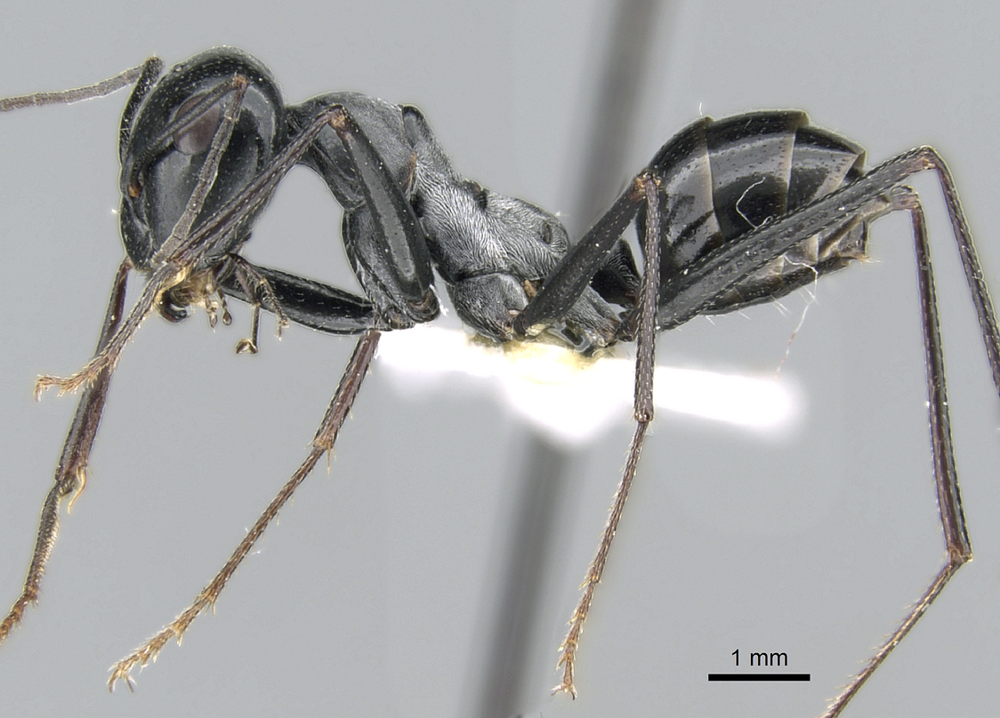

# TFCB- HOMEWORK01

## Section 1: Images
Here are the images from the homework assignment located in the `images/` directory:

## Section 2: Lists
Here is my grocery list from today:
- Oat milk
- Cauliflower
- Onion
- Kale
- Honeycrisp Apples
- Oreos 
- Tofu 

## Section 3: Links
Here is a link my Github account (https://github.com/marygracelinsley).

## Section 4: Tables
Here are the nutrition facts for my groceries:

# Nutrition Facts per Serving

This table shows the macronutrients (calories, carbohydrates, fats, and proteins) in a typical serving of each of the listed items.

| Food Item           | Calories | Carbohydrates (g) | Fats (g) | Proteins (g) |
|---------------------|----------|-------------------|----------|--------------|
| **Oat Milk**         | 120      | 16                | 5        | 3            |
| **Cauliflower**      | 25       | 5                 | 0        | 2            |
| **Onion**            | 40       | 9                 | 0        | 1            |
| **Kale**             | 35       | 7                 | 1        | 3            |
| **Honeycrisp Apple** | 80       | 22                | 0        | 0            |
| **Oreos**            | 160      | 25                | 7        | 1            |
| **Tofu**             | 70       | 2                 | 4        | 8            |

